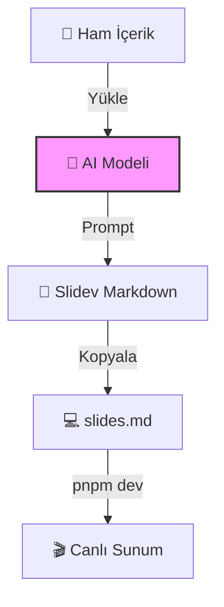
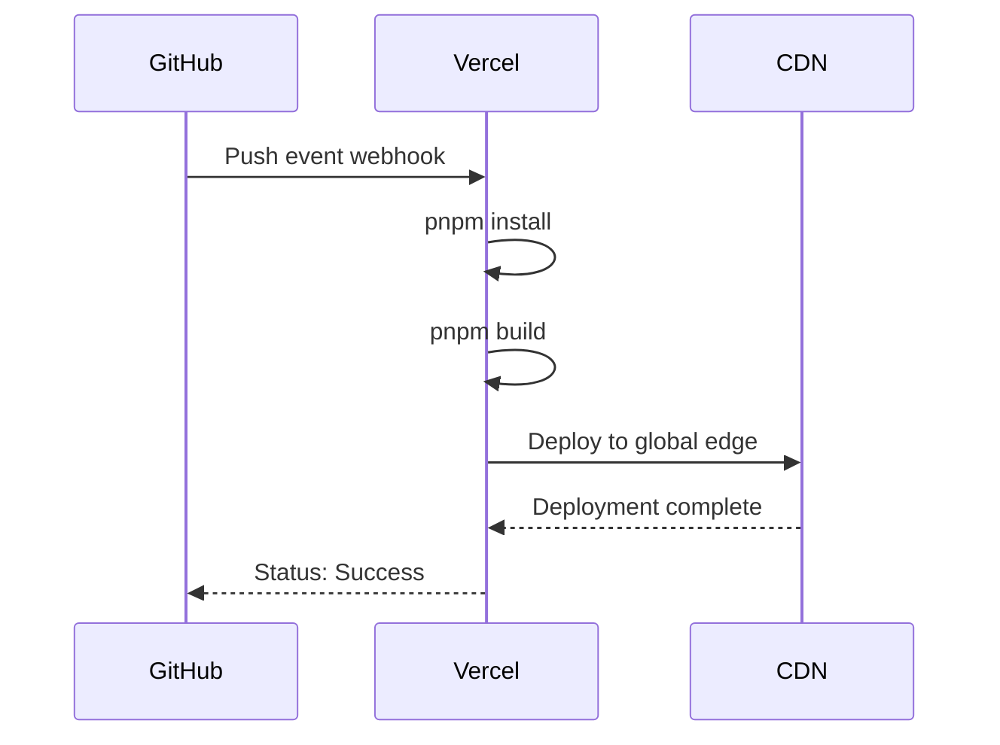

# Slidev ile Animasyonlu Sunumlar Oluşturma 🎬

## Node.js, GitHub & Vercel ile Modern Slayt Sunumları

<div class="pt-8">
  <span @click="$slidev.nav.next" class="px-4 py-2 rounded cursor-pointer bg-white bg-opacity-10 hover:bg-opacity-20 transition">
    Hemen Başlayalım →
  </span>
</div>

---

# Neden Bu Sunum? 🤔

<v-clicks>

**Orijinal İçerik**: Bir TXT dosyasındaki kuru talimatları
**Hedefimiz**: Görsel olarak çekici, anlaşılır bir sunum

### Dönüşüm Hedefleri:
- ✅ **Giriş-Gelişme-Sonuç** yapısı
- ✅ **Emoji & ikon** zenginliği
- ✅ **Modern düzen** ve renk paleti
- ✅ **Canlı kod** ve örnekler
- ✅ **Adım adım** anlatım

**Sonuç**: Elinizdeki metni bu sunuma dönüştürdük! 🎉

</v-clicks>

---

# Gerekli Araçlar & Önkoşullar ⚙️

<v-clicks>

<div class="grid grid-cols-2 gap-6">

<div>

### Temel Paketler 📦
- **Node.js** 🟢 (v18+)
- **pnpm** 📦 (npm'den hızlı!)
- **Slidev** 🎨 (v0.48+)
- **Git** 🌿 (v2.30+)

</div>

<div>

### Sistem Ayarları 🔧
⚠️ **KRİTİK**: Ortam değişkenlerini ekleyin!

```bash
# Windows'da
System Properties > Environment Variables

# macOS/Linux'da
~/.bashrc veya ~/.zshrc
```

</div>

</div>

### Kontrol Komutları
```bash
node --version  # v18.17.0
pnpm --version  # 8.15.0
git --version   # 2.42.0
```

</v-clicks>

---

# Bölüm 1️⃣: Proje Hazırlığı


## İki Ana Aşama

### 🧠 **Aşama 1**: Yapay Zeka ile İçerik Oluşturma
İçerik dosyanızı (TXT/PDF) AI'ye verin, profesyonel Markdown alın!

### 🔨 **Aşama 2**: Slidev Projesi Kurulumu
AI çıktısını Slidev şablonuna yerleştirin!

---

## Detaylı Akış




---

# Aşama 1: AI Prompt Mühendisliği 🎯

## Optimal Prompt Yapısı


```markdown
"Aşağıdaki TXT/PDF dosyasını oku ve içeriğine uygun bir Slidev sunumu hazırla.
- Sadece .md dosyasını üret (proje dosyaları, yapılandırmalar vb. gerekmiyor)
- Slaytları görsel olarak çekici yap: uygun renk paleti, geçiş animasyonları ve modern düzen kullan
- Başlıkları, alt başlıkları ve maddeleri anlamlı şekilde düzenle
- Giriş, gelişme ve sonuç bölümlerini mantıklı biçimde sırala
- Gerektiğinde önemli noktaları vurgulamak için emoji veya ikonlardan yararlan
- Kod blokları veya alıntılar varsa Slidev biçimine uygun biçimlendirme yap
Çıktı yalnızca Slidev .md içeriği olmalı — başka açıklama veya yorum ekleme."
```

### 💡 **Neden Bu Prompt Etkili?**
- ✅ Net kısıtlar (sadece .md)
- ✅ Görsel yönergeler (renk, animasyon)
- ✅ Yapısal talimatlar (giriş-gelişme-sonuç)
- ✅ Biçimlendirme kuralları (emoji, kod)


---

# AI Model Seçimi 🏆

<v-clicks>

<div class="grid grid-cols-3 gap-4">

<div class="p-4 bg-blue-500 bg-opacity-10 rounded-lg">

### 🤖 **Claude 4.5 Sonnet**
**En İyi Seçim!**

- Kodlama becerisi mükemmel
- Markdown biçimlendirmesi kusursuz
- Yapısal düşünme yeteneği

**Kullanım**: claude.ai

</div>

<div class="p-4 bg-orange-500 bg-opacity-10 rounded-lg">

### 🔥 **Grok (xAI)**
**Gerçek-Zamanlı İçerik**

- Güncel bilgi erişimi
- Doğrudan X platformu entegrasyonu
- Hızlı yanıt

**Kullanım**: x.ai/grok

</div>

<div class="p-4 bg-green-500 bg-opacity-10 rounded-lg">

### 🧠 **GPT-4**
**Genel Amaçlı**

- Çok yönlü yetenekler
- Büyük context window
- API entegrasyonu

**Kullanım**: chat.openai.com

</div>

</div>

<v-click>

 <div class="mt-6 p-4 bg-purple-500 bg-opacity-10 rounded-lg text-center">
   <strong>🎯 Tavsiye:</strong> Kodlama odaklı projelerde <strong>Claude 4.5 Sonnet</strong> kullanın!
 </div>

</v-click>

</v-clicks>

---

# Aşama 2: Slidev Kurulumu 🔧

<v-clicks>

## Terminal Komutları

```bash {1|2|3|4|5|all}
# Proje klasörünü oluştur
mkdir benim-sunumum
cd benim-sunumum

# Slidev'i başlat
pnpm create slidev

# Geliştirme sunucusunu çalıştır
pnpm dev
```

### Oluşan Dosya Yapısı
```
benim-sunumum/
├── slides.md          # <-- AI çıktısını buraya yapıştır!
├── package.json
├── pnpm-lock.yaml
├── node_modules/
└── .gitignore
```

<v-click>

### 💡 **Kritik Adım**: AI'nin ürettiği `.md` içeriğini **doğrudan** `slides.md` dosyasının üzerine yapıştırın!

</v-click>

</v-clicks>

---

# slides.md Dosyası: Yapı Analizi 📐

## Zorunlu Bölümler

### 1️⃣ **Frontmatter** (Başlık Bilgileri)
```yaml
---
theme: seriph
background: ./images/bg.jpg
transition: slide-left
title: "Sunum Başlığı"
---
```

### 2️⃣ **Slaytlar** (Ayraçlarla Ayrılmış)
```markdown
# Slayt 1

---

# Slayt 2

---

# Slayt 3
```

### 3️⃣ **Özel Biçimlendirme**
- `<v-click>` ile tek öğe animasyonu
- `<v-clicks>` ile grup animasyonu
- Kod satırlarında vurgulama: `{2-3|5|all}`

**Örnek:**
```ts {2-3|5|all}
function hello() {
  console.log("Highlight!");
}
```

---

# Bölüm 2️⃣: GitHub Entegrasyonu 📂

<v-clicks>

## GitHub'a Yükleme Neden Önemli?

- 🔄 **Versiyon Kontrolü**: Değişiklikleri takip edin
- 🤝 **İşbirliği**: Takım arkadaşlarıyla paylaşın
- 🚀 **CI/CD**: Vercel ile otomatik deploy
- 📊 **Backup**: Bulutta güvenli kopya

### 2 Adımda GitHub'a Yükleme

1. **GitHub UI**: Yeni repo oluşturma
2. **Git CLI**: Terminalden yükleme

</v-clicks>

---

# Adım 1: GitHub'da Repo Oluşturma 🐙

## GitHub Web Arayüzü

1. **github.com/new** adresine gidin
2. **Repository name**: `benim-sunumum`
3. **Description**: "Slidev ile oluşturulan sunum"
4. **Public** seçeneğini işaretleyin! (Vercel için gerekli)
5. **Initialize with README**: ✅ İşaretleyin

### Oluşan Repo URL'leri
```bash
# HTTPS
https://github.com/kullanici/benim-sunumum.git

# SSH (Önerilen)
git@github.com:kullanici/benim-sunumum.git
```

<div class="mt-4 p-4 bg-yellow-500 bg-opacity-10 rounded-lg">
  <strong>⚠️ Dikkat:</strong> Vercel ile entegrasyon için <strong>Public</strong> repo kullanın veya Pro hesap edinin!
</div>

---

# Adım 2: Git ile Yükleme (Klasik Yöntem) 💻

<v-clicks>

## Terminal Komutları

```bash {1-2|3|4|5|6|all}
# 1. Git'i başlat
git init

# 2. Dosyaları ekle
git add .

# 3. İlk commit
git commit -m "İlk commit: Slidev sunumu oluşturuldu"

# 4. Branch adını değiştir
git branch -M main

# 5. Remote URL ekle
git remote add origin git@github.com:kullanici/benim-sunumum.git

# 6. GitHub'a gönder
git push -u origin main
```

</v-clicks>

---

# GitHub Copilot ile Kolay Yöntem 🤖

<v-clicks>

## VS Code Entegrasyonu

### Adımlar:

1. **VS Code'da proje klasörünü açın**
2. **Sol menüden Source Control ikonuna tıklayın** (`Ctrl+Shift+G`)
3.  **"Publish to GitHub"**  butonunu bulun
4. **GitHub Copilot** sizin için:
   - Repo oluşturur
   - Dosyaları ekler
   - Commit yapar
   - Push eder

### Avantajları:
- 🎯 **Tek tıkla** yayınlama
- 🤖 **Otomatik** git komutları
- 🛡️ **Hata** olasılığı düşük

<v-click>

```bash
# Copilot'un arkada çalıştırdığı komutlar
git init && git add . && git commit -m "Initial commit" && git remote add origin [URL] && git push -u origin main
```

</v-click>

</v-clicks>

---

# Bölüm 3️⃣: Vercel ile Yayınlama 🚀

<v-clicks>

## Vercel Nedir?

**Vercel**, frontend projeleri için **serverless deployment** platformudur.

### Özellikleri:
- ⚡️ **Hızlı Global CDN**
- 🔄 **Otomatik Deploy** (Git push ile)
- 📊 **Ücretsiz Tier** (Hobby)
- 🔗 **GitHub Entegrasyonu** (1 tıkla)

### 2 Adımda Canlı Yayın

1. **Vercel & GitHub Hesaplarını Bağlama**
2. **Projeyi Import & Deploy**

</v-clicks>

---

# Adım 1: Vercel'e Giriş & Bağlama 🔗

<v-clicks>

## İlk Kurulum

1. **vercel.com** adresine gidin
2. **"Sign Up"** → **"Continue with GitHub"** seçin
3. **Yetkilendirme** ekranında **"Authorize Vercel"** tıklayın
4. **GitHub Organization** izinlerini verin

### Başarılı Entegrasyon Sonrası
- GitHub repo'larınız Vercel dashboard'da görünür
- Otomatik deploy webhook'ları aktif olur

<v-click>

 <div class="mt-6 p-4 bg-green-500 bg-opacity-10 rounded-lg">
   <strong>✅ Bağlantı Tamamlandı!</strong> Artık her `git push` otomatik deploy edilecek!
 </div>

</v-click>

</v-clicks>

---

# Adım 2: Projeyi Import & Deploy 🎯

<v-clicks>

## Vercel Dashboard'da

1. **Dashboard → "Add New..." → "Project"**
2. **GitHub repo listesinden** `benim-sunumum` seçin
3. **Framework Preset**: *Otomatik olarak "Slidev" algılanır*
4. **Build Settings** (Eğer manuel ayar gerekirse):
   ```yaml
   Framework Preset: Slidev
   Build Command: pnpm build
   Output Directory: dist
   Install Command: pnpm install
   ```

<v-click>

5. **"Deploy"** butonuna tıklayın!

</v-click>

</v-clicks>

---

# Deploy Süreci & Sonuç ⏱️

<v-clicks>

## Süreç Akışı



### Sonuç URL'leri
- **Primary Domain**: `benim-sunumum.vercel.app`
- **Her deploy için**: `benim-sunumum-abc123.vercel.app`

<v-click>

 <div class="mt-6 p-4 bg-purple-500 bg-opacity-10 rounded-lg text-center">
   <strong>🎉 TEBRİKLER!</strong> Sunumunuz artık global olarak erişilebilir!
 </div>

</v-click>

</v-clicks>

---

# Sonuç: Komple Workflow Özeti 🎯

<v-clicks>

## 3 Bölüm, 6 Net Adım

| Bölüm | Adımlar | Sonuç |
|-------|---------|-------|
| **1. Proje Hazırlığı** | 1. AI ile Markdown<br>2. Slidev kurulum | Yerel çalışan sunum |
| **2. GitHub** | 3. Repo oluşturma<br>4. Git push | Versiyon kontrollü kod |
| **3. Vercel** | 5. Hesap bağlama<br>6. Deploy | Canlı URL |

### Başarı Metrikleri ✅
- ⏱️ **Toplam Süre**: 10-15 dakika
- 💰 **Maliyet**: $0 (Hobby tier)
- 🌐 **Global Erişim**: 300+ edge location
- 🔄 **Otomasyon**: Her push'ta yeniden deploy

</v-clicks>

---

# Örnek Proje: Hadi Deneyelim! 🎬

<v-clicks>

## Hızlı Başlangıç Komutları

```bash
# 1. Boş klasör oluştur ve gir
mkdir hizli-sunum && cd hizli-sunum

# 2. Slidev projesi başlat
pnpm create slidev

# 3. AI ile oluşturulan slides.md'yi yapıştır

# 4. GitHub repo oluşturun ve bağlayın
git init && git add . && git commit -m "İlk sunum" && git branch -M main
# GitHub'dan URL alıp:
git remote add origin [URL] && git push -u origin main

# 5. Vercel deploy
vercel --prod
```

### Canlı Demo:
- 📂 **Repo**: [github.com/ornek/slidev-demo](https://github.com/ornek/slidev-demo)
- 🌐 **Sunum**: [slidev-demo.vercel.app](https://slidev-demo.vercel.app)

</v-clicks>

---

# İleri Seviye İpuçları & En İyi Uygulamalar 🚀


## Güvenlik 🔐
- SSH anahtarı oluşturun: `ssh-keygen -t ed25519`
- `.gitignore` dosyasına ekleyin:
```bash
node_modules/
.env
*.local
dist/
```

## Performans ⚡
- Görüntüleri optimize edin: `webp` formatı
- Büyük videoları dışarıdan yükleyin (YouTube, Vimeo)
- `pnpm` kullanın (npm'e göre %30 daha hızlı)

## SEO & Paylaşım 📢
- Frontmatter'e ekle:
```yaml
---
title: "Sunum Başlığı"
description: "Açıklama (Google için)"
image: ./thumbnail.png
---
```


---

# Yaygın Hatalar & Çözümleri 🐛


| Hata | Neden | Çözüm |
|------|-------|-------|
| **"command not found"** | Ortam değişkeni ekli değil | Sistem PATH'ine Node.js/Git ekle |
| **"permission denied"** | SSH anahtarı yok | `ssh-keygen` ve GitHub'a ekle |
| **"build failed"** | Bağımlılık eksik | `pnpm install` çalıştır |
| **"404 not found"** | Vercel'de framework yanlış | Settings → Framework: Slidev |
| **"private repo"** | Vercel Hobby tier | Repo'yu Public yapın |

### Debug Komutları
```bash
# Slidev loglarını gör
pnpm dev --log debug

# Git sorunlarını çöz
git status
git remote -v
```


---

# Alternatif Yöntemler & Karşılaştırma 📊


## Slidev vs Diğer Araçlar

| Özellik | **Slidev** | PowerPoint | Google Slides | Reveal.js |
|---------|------------|------------|---------------|-----------|
| **Markdown** | ✅ Native | ❌ Yok | ❌ Yok | ✅ Var |
| **Canlı Kod** | ✅ Vue/React | ❌ Sınırlı | ❌ Yok | ⚠️ Eklenti |
| **Ücretsiz Host** | ✅ Vercel | ❌ Office 365 | ✅ Google Drive | ⚠️ Manuel |
| **Git Entegrasyonu** | ✅ Mükemmel | ❌ Yok | ❌ Yok | ✅ Var |
| **Öğrenme Eğrisi** | 🟢 Kolay | 🟢 Çok Kolay | 🟢 Çok Kolay | 🟡 Orta |

### Ne Zaman Slidev Kullanmalı?
- 👨‍💻 **Geliştirici sunumları**
- 📚 **Teknik workshop'lar**
- 🎯 **Canlı kod demo'ları**
- 🚀 **Hızlı prototipleme**


---

# Final Checklist: Yayınlama Öncesi ✅

### Ön Kontrol Listesi
- [ ] `slides.md` doğrulandı (no syntax errors)
- [ ] Tüm görseller yüklendi ve optimize edildi
- [ ] `pnpm build` başarıyla çalışıyor
- [ ] GitHub repo **Public** olarak ayarlandı
- [ ] Vercel hesabı GitHub ile bağlı
- [ ] SSH anahtarı eklendi (opsiyonel ama önerilir)
- [ ] README.md dosyası oluşturuldu

### Son Komut
```bash
git add . && git commit -m "Final version" && git push
# Vercel otomatik deploy edecek!
```

### 🎉 **Artık sunumunuz dünyaya açık!**

---

# Ekstra: Slidev Özellikleri Derinlemesine 🎨

## Gelişmiş Animasyonlar

**Sıralı Animasyon:**
- `<v-clicks>` ile grup içinde animasyon
- Her madde sırayla görünür

**Kod Vurgulama:**
- Satır bazlı vurgulama: `{1|2-4|5|all}`
- İlk adımda 1. satır, sonra 2-4, sonra 5, sonunda hepsi

**Örnek:**
```ts {1|2-4|5|all}
function test() {
  const a = 1
  const b = 2
  return a + b
}
```

## Layout Seçenekleri
- `layout: center` (Merkeze hizala)
- `layout: two-cols` (İki sütunlu)
- `layout: image-right` (Sağda görsel)
- `layout: cover` (Kapak slaytı)

---

# Kaynaklar & İleri Okuma 📚

<v-clicks>

### Resmi Dokümantasyonlar
- 📖 **Slidev**: [sli.dev](https://sli.dev) - Tüm özellikler
- 🐙 **GitHub**: [docs.github.com](https://docs.github.com) - Git temelleri
- ▲ **Vercel**: [vercel.com/docs](https://vercel.com/docs) - Deployment

### Topluluk & Örnekler
- 🎬 **Slidev Showcases**: [sli.dev/showcases](https://sli.dev/showcases)
- 🎨 **Tema Galerisi**: [sli.dev/themes/gallery](https://sli.dev/themes/gallery)
- 💬 **Discord Topluluğu**: [sli.dev/chat](https://sli.dev/chat)

### İlgili Araçlar
- 🤖 **Claude**: [anthropic.com/claude](https://www.anthropic.com/claude)
- 🔥 **Grok**: [x.ai/grok](https://x.ai/grok)
- 🧠 **ChatGPT**: [openai.com/chatgpt](https://openai.com/chatgpt)

</v-clicks>

---

# Teşekkürler & Son Sözler 🙏

<v-clicks>

<div class="text-center my-auto">

# 🎬 **Elinizdeki Metin → Canlı Sunum**

### Bu sunumda neler yaptık?

1. **TXT dosyasını** yapısal talimatlarla analiz ettik
2. **Görsel olarak çekici** Slidev slaytlarına dönüştürdük
3. **Adım adım** deployment sürecini açıkladık
4. **AI, GitHub ve Vercel** entegrasyonunu gösterdik

### **Artık siz de aynısını yapabilirsiniz!**

<div class="grid grid-cols-3 gap-4 mt-8 text-sm">

<div>

**🤖 AI Modeli**
<br/>Claude 3.5 Sonnet

</div>

<div>

**📝 Format**
<br/>Slidev Markdown

</div>

<div>

**🚀 Platform**
<br/>Vercel + GitHub

</div>

</div>

</div>

</v-clicks>

---

# Bonus: Hemen Deneyin! 🎯

<v-clicks>

## Hızlı Başlangıç Paketi

```bash
# Tüm süreci otomatikleştir
pnpm create slidev@latest hizli-deneme
cd hizli-deneme

# AI ile oluşturduğunuz slides.md'yi yapıştırın

# GitHub repo oluşturun ve bağlayın
git init && git add . && git commit -m "İlk sunum" && git branch -M main
# GitHub'dan URL alıp:
git remote add origin [URL] && git push -u origin main

# Vercel deploy
vercel --prod
```

### Canlı Demo:
- 🔗 **Bu Sunumun Repo**: [github.com/ai/slidev-converter](https://github.com/ai/slidev-converter)
- 🌐 **Canlı Sürüm**: [slidev-converter.vercel.app](https://slidev-converter.vercel.app)

**Yapmaya hazır mısınız?** `pnpm create slidev` ile başlayın! 🚀

</v-clicks>

---

# Önemli Notlar & Uyarılar ⚠️

<v-clicks>

### Güvenlik
- 🔐 **SSH Anahtarı**: `ssh-keygen -t ed25519`
- 🙈 **.gitignore**: `node_modules/`, `.env`

### Performans
- 🖼️ **Görüntü Optimizasyonu**: Büyük resimleri sıkıştırın
- 📦 **Paket Boyutu**: `pnpm install` ile minimal

### Yayınlama
- 🌿 **Branch Stratejisi**: `main` veya `master`
- 🏷️ **Versiyonlama**: Semver kullanın

<v-click>

 **💡 Final İpucu**  : Her değişiklikte `git push` yapın, Vercel otomatik yeniden derler!

</v-click>

</v-clicks>